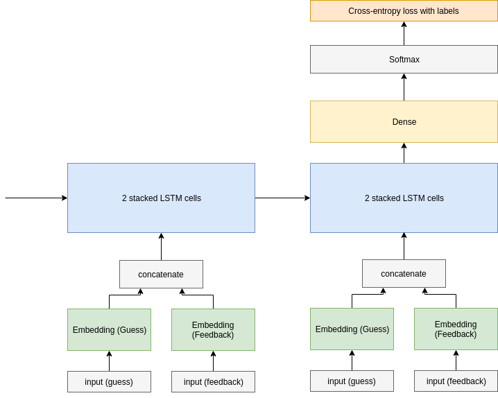

# Mastermind

This repo has code to learn an optimal strategy for the game
[mastermind](https://en.wikipedia.org/wiki/Mastermind_(board_game)) using
reinforcement learning. 

This is done using [policy gradients](https://medium.freecodecamp.org/an-introduction-to-policy-gradients-with-cartpole-and-doom-495b5ef2207f). 

We model the states to be the full history of moves made so far and their feedback. So, for example, the history could be:

History: state + feedback

- 0011 ++--
- 1010 ++++

An action in this model is choosing the next guess based on this history. A
guess is a 4-digit base-6 number. We want to model the policy. So,
the goal of the model is to take this history and produce a new guess: a single
4-digit base-6 number. As the input is a *sequence* of state-feedback pairs, it
is natural to pick a *sequence model* such as an RNN. So, we choose an RNN with
LSTM cells. 



The neural net has:

- 2 embedding layers, one for the tokenized guess input and one for the
  tokenized feedback input. Note that
    - There are 6^4 possible guesses, one for each 4-digit base 6 numbers. The
      number of possible input tokens to the embedding layer is 6^4 + 1, the +1
      stemming from an additional 'start' token
    - Similarly, the input for the feedback embedding is 15 + 1, given 15
      possible feedbacks and a +1 start token.
    - The 2 embeddings are then concatenated to produce a vector of dimension
      2500
- 2 stacked LSTM cells, both with size 2500
- A final fully connected layer, outputting a vector of size 6^4, followed by a
  softmax layer. The final output is a vector of probabilities for each guess.

In tensorflow:

```python
class Policy:
    """
    Our policy. Takes as input the current state as a list of
    input/feedback indices and outputs the action distribution.
    """

    def __init__(self):
        self.guess_embedding = Embedding(6**4 + 1, 
                                         2500 - 250)
        self.feedback_embedding = Embedding(15 + 1,
                                            250)
        self.lstm = MultiRNNCell([
            LSTMCell(2500),
            LSTMCell(2500)
        ])

        self.dense = tf.layers.Dense(6**4)

    def __call__(self, game_state, with_softmax=True):
        """
        Do a forward pass to get the action distribution
        """

        state = self.lstm.zero_state(1, tf.float32)

        for guess, feedback in game_state:
            guess_tensor = tf.reshape(tf.convert_to_tensor(guess), (1,))
            feedback_tensor = tf.reshape(tf.convert_to_tensor(feedback), (1,))
            guess_embedded = self.guess_embedding(guess_tensor)
            feedback_embedded = self.feedback_embedding(feedback_tensor)

            combined_embedded = tf.concat([guess_embedded,
                                            feedback_embedded],
                                            axis=-1)
            # can I do multiple inputs to the LSTM instead of concatenating?

            output, state = self.lstm(combined_embedded, state)

        logits = self.dense(output)
        if with_softmax:
            return tf.nn.softmax(logits)
        return logits
```

This code is taken and adapted from the `policy.py` script. 

The policy is then learned using the REINFORCE algorithm. REINFORCE loops forever: 

- generate an episode S0, A0, R1, ... ST-1, AT-1, RT according to the policy.
  The rewards Rt are all set to be -1, and the maximum episode length is capped
  at 30.
- loop for each step of the episode t=0, 1, ... T-1:
    - 
    - 

Here gamma is the discount factor, which we set to 1, and alpha is a parameter, currently set to 0.001.
The grad is taken with respect to theta, our set of model parameters.

[//]: # (original latex equations:)
[//]: # (G \leftarrow \sum_{k=t+1}^T R_k)
[//]: # (\theta \leftarrow \theta + \alpha \gamma^t G \nabla_\theta \ln \pi(A_t | S_t, \theta))
[//]: # ( \ln \pi(A_t | S_t, \theta) &=  \sum_a 1_{A_t} \ln \pi(a | S_t, \theta) \\ &= - \text{cross-entropy}(1_{A_t}, \pi(\cdot | S_t, \theta)))

To implement this update easily using tensorflow, we can use the traditional
cross-entropy loss, since


where `1_{A_t}` is the constant policy/distribution that assigns action `A_t`
probability one. In code, we have:

```python
action_logits = pol(history_so_far, with_softmax=False)
loss = tf.nn.softmax_cross_entropy_with_logits_v2(
    labels=tf.one_hot(
        tf.convert_to_tensor([next_action]),
        config.max_guesses),
    logits=action_logits
)
```

(from train.py).

So we compute the gradient relative to the cross-entropy loss
function given the constant policy as labels.
